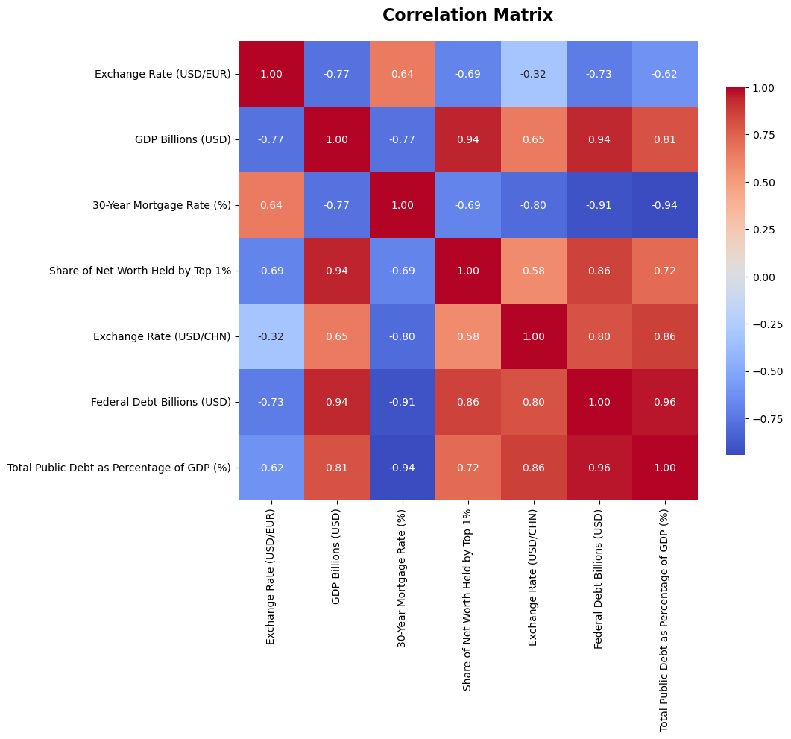
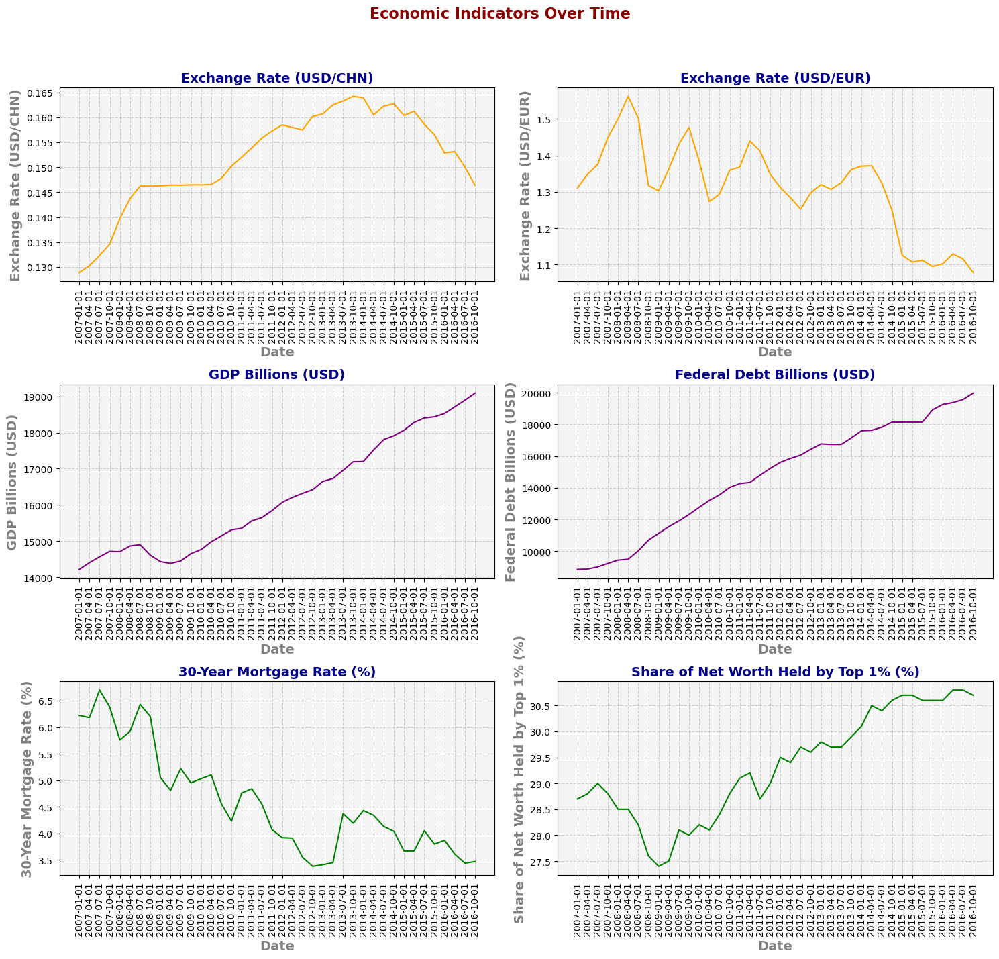

<h1 style="font-size: 400%; text-align:center;"> Analyzing U.S. Economic Indicators </h1>

 Written by Victor Chang | MBA 615 - Descriptive Analytics 

  

<h1 style="text-align:center;"> Executive Summary </h1>

This project analyzes six major U.S. economic indicators from 2006 to 2016 using data from the St. Louis Federal Reserve. Key indicators include GDP, federal debt, mortgage rates, wealth concentration, and USD exchange rates with the Chinese Yuan and Euro.

Findings reveal a strong correlation between GDP and federal debt, suggesting growth during this period was debt driven. Exchange rates showed contrasting effects: a stronger dollar against the Yuan aligned with rising GDP and debt, while strength against the Euro correlated with declines in both. Additionally, wealth concentration among the top 1% increased as mortgage rates declined, pointing to growing inequality.

Overall, the analysis highlights key post recession trends in U.S. economic health and raises important considerations for fiscal policy and wealth distribution.

<h1 style="text-align:center;"> Data Extraction </h1>

<b style="font-size: 125%;"> St. Louis Federal Reserve Website </b>

Data was gathered from the [St. Louis Federal Reserve Website](https://fred.stlouisfed.org/)

The following six U.S. Economic Indicators were analyzed in this study:

- [Gross Domestic Product](https://fred.stlouisfed.org/series/GDP)
- [Federal Debt: Total Public Debt](https://fred.stlouisfed.org/series/GFDEBTN)
- [Share of Net Worth Held by the Top 1% (99th to 100th Wealth Percentiles)](https://fred.stlouisfed.org/series/WFRBST01134#)
- [30-Year Fixed Rate Mortgage Average in the United States](https://fred.stlouisfed.org/series/MORTGAGE30US)
- [Chinese Yuan Renminbi to U.S. Dollar Spot Exchange Rate](https://fred.stlouisfed.org/series/EXCHUS)
- [U.S. Dollars to Euro Spot Exchange Rate](https://fred.stlouisfed.org/series/EXUSEU)

The data extracted was filtered to include only 10 years, starting on December 2006 and ending on December 2016. The data was gathered quarterly and merged into a single dataframe with a matching date column.

<h1 style="text-align:center;"> Data Visualizations </h1>

The data was analyzed and visualized using static and dynamic. Both the data columns and dynamic maps are better visualized in the streamlit application below. Additional graphs are also displayed below to show data correlation and trends over time for each economic indicator.

<b style="font-size: 125%;"> Streamlit Application </b>

[Click Here!](https://useconomicindicators.streamlit.app/)

<b style="font-size: 125%;"> Correlation Heatmap </b>

<b style="font-size: 125%;"> Trends Over Time Lineplots </b>

<h1 style="text-align:center;"> Data Analysis </h1>

<b style="font-size: 125%;"> Correlations </b>

Looking at the correlation heatmap, we see that many economic indicators share both positive and negative high correlations with each other. One of the more interesting findings relate exchange rate with GDP and federal debt. We see that the USD/CHN exchange rate has a positive correlation with both, but a stronger positive correlation with deferal debt; an indicator that when the US dollar has increased in value to the Chinese Yuan, the US has experienced both an increased in GDP and increase in federal debt. However, looking at the USD/EUR exchange rate, we actually get an inverse correlation, showing that when the US dollar has increased in value to the Euro, the US experiences a decrease in federal debt and GDP. We can see that a general trend of US GDP growth is when the US dollar becomes more highly valued than the Yuan, but less highly valued than the Euro. 

<b style="font-size: 125%;"> Time Data </b>

From the graphs above, we can confirm that exchange rates between the US and China are inversely correlated to US and Europe. We can also see a positive correlation between both, GDP and federal debt, indicating that the US cannot increase their GDP without accumulating debt. There is also an interesting trend for 30-year mortage rates over time and how they negatively correlate to wealth distribution among the few. The more ownership of wealth the 1% of the population has, the more 30-year mortgage rates seem to be at. Interestingly, it seems that between 2006 and 2016, mortgage rates have continued to increase, while wealth of the 1% has continued to icnrease. Finally, analyzing graphs from the normalized data, we notice that the exchange rates for both USD/CHN and USD/EUR have been on a decrease for the past 2 years. More interestingly, looking at Debt as a Percentage of GDP, this indicator has been rapidly increasing since 2006, but has begun to steady around 2014. The same pattern is shown for the sahre of net worth wealth held by the top 1%, which might suggest a pattern that while the share of net worth wealth held by the top 1% stops increasing so does the total public debt as a percentage of GDP. 

